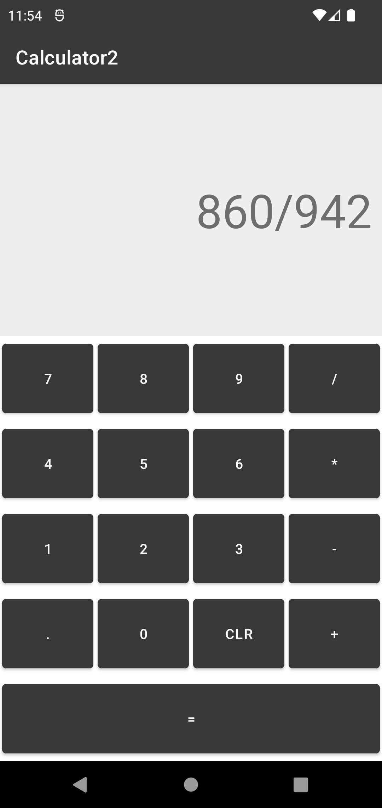

# Calculator2
A calculator app which intended to understand fundamentals of Kotlin.

---ScreenShots & Videos---

 | 

[calculator2.webm](https://user-images.githubusercontent.com/102043234/228991090-a522024b-f364-4069-a93f-cf29f1015c67.webm)
